# Evaluation des compétences Automatisation Bash

**Alexy VANOT**  
**S8 IL – 2024**  
**Devoir 06/12/2024 13h30 – 17h15**  
[!] Remise Tardive Autorisée à 17h30 [!]

---

## 1. Administration Linux (1,5 heure)

### **Attentes Partage**

L’ESIEA souhaite permettre un accès aux fichiers de chaque service sur un seul et même serveur. Dans ce sens, vous allez devoir créer sur votre serveur Linux :

- Créer des utilisateurs et des groupes. 📷
  - Les groupes seront les suivants :  
    - **ASI**  📷
    - **IL**   📷

> *Création des groupes et des utilisateurs et assignation des utilisateurs aux groupes à la volée.*
> 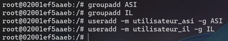

- Créer un dossier commun en root nommé **ASI** et un autre **IL** avec un fichier dans chaque dossier. 📷

> 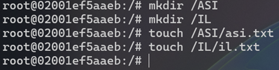
> 

- Modifier les permissions aux répertoires **ASI** et **IL** afin que les répertoires ne soient consultables et modifiables que par les utilisateurs des groupes. 📷

> *Assignation du dossier racine pour chaque groupe d’utilisateur et application des permissions.*
> 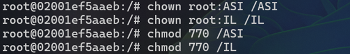
> 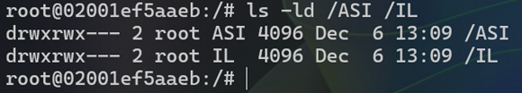
> *La commande aurait fonctionné avec : `u=rwx,g=rwx,o=` pour argument... à la place nous voyons les 7 pour **rwx***

- Loguez-vous avec un utilisateur du groupe **IL** et essayez de créer un fichier dans le dossier **ASI**, puis faites-le avec un utilisateur du groupe **ASI**. 📷

> *Création de fichiers dans les dossiers respectifs.... les utilisateurs n'ont pas le droit de créer des fichiers dans les dossiers des autres groupes.*
> 
> 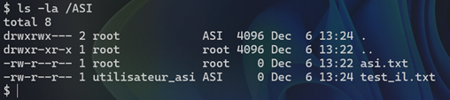

---

### **Attentes LAMP**

L’ESIEA souhaite mettre en place le serveur web sur une VM sous Linux. Dans ce sens, vous allez devoir :

- Mettre en place un serveur web. 📷

> Lancement du sandbox Docker et exposer les ports pour la suite, puis mise à jour avec :  
> `apt update && apt upgrade -y`
> Puis installation de Apache :  
> `apt install -y apache2`
> et de MariaDB :
> `apt install mariadb-server mariadb-client`
> `mysql_secure_installation`
> et de PHP :
> `apt install php libapache2-mod-php php-mysql`
> etc...
> 
> 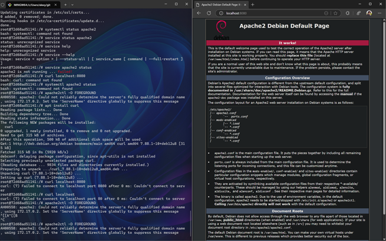

- Sécuriser ce serveur web (montrer comment le sécuriser) : 📷

> Ne pas voir la version d’Apache : 📷
> `root@72d68ad51141:/etc/apache2/conf-available# vi security.conf`
> 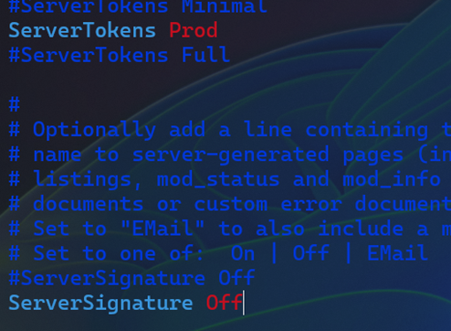

- Mise en place d’HTTPS. 📷

> - Génération de certificat et clé privée et placement directement aux bons endroits.📷
> 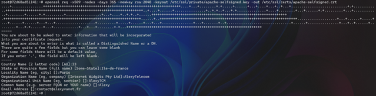
> - Activation du module SSL pour certificat et par défaut.
> 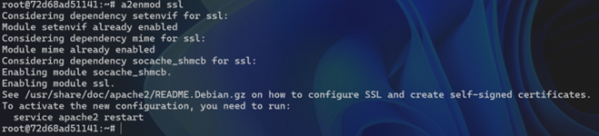
> 
> - Puis configuration du SSL par défaut dans le fichier :  
> `/etc/apache2/sites-available/default-ssl.conf`
> 
> - Redémarrage du service Apache.
> 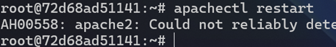
.
> **Problème:** J'ai eu un problème avec le certificat, celui-ci n'était pas en mesure d'être verifié par le navigateur car il n'était pas signé par une autorité de certification semblerait-il.... J'ai essayé de le signer avec Let's Encrypt mais je n'ai pas réussi à le faire fonctionner en raison que Let's Encrypt ne peut pas signer un certificat pour localhost.... J'ai donc laissé le certificat auto-signé.... cepandant, le HTTPS ne fonctionne pas donc j'ai laissé le site en HTTP et je suis passé à la suite
>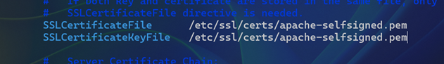
.
> - Accès à la base de données via la ligne de commande. 📷
>   - Installation de MariaDB :  
> `apt install mariadb-server mariadb-client` puis configuration avec :  
> `mysql_secure_installation`
> 
>   - Création d’une base de données « devforlife ».
>   
>   - Création d’un utilisateur « testdev ».
>   
>    J'ai donné les permissions sur la BDD puis exécuté :  
>    `FLUSH PRIVILEGES;` afin de prendre en compte les changements.
> - Accès à Phpmyadmin. 📷
>   - Connexion via l’utilisateur testdev.
>   
>   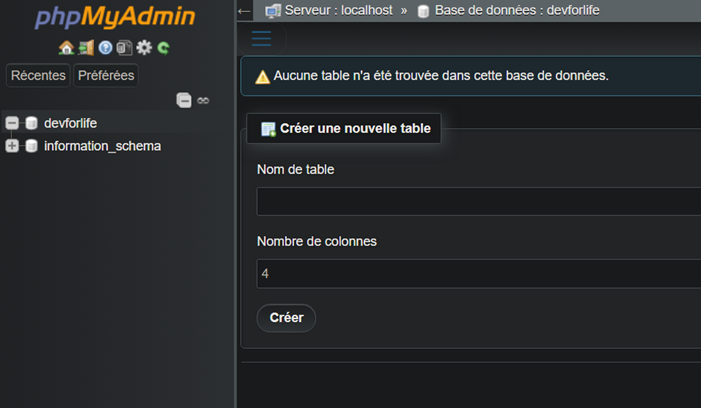
> - Un site web « simple » devra être mis en place avec juste une ligne personnalisée écrite en PHP. 📷
>   - Création du fichier index.php dans le dossier /var/www/html/ avec le contenu suivant :
>   
>   - Accès au site web via le navigateur.
>   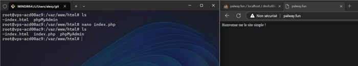

---

## 2. Automatisation BASH (1 heure)

### Instructions

Assurez-vous de lire attentivement chaque question avant de répondre. Utilisez les commandes bash appropriées pour répondre aux questions. Notez que vous pouvez avoir besoin de créer des scripts ou des pipelines de commandes pour certaines questions.

---

### Manipulation de fichiers

**A.** Utilisez la commande `cut` pour afficher uniquement la deuxième colonne du fichier `/etc/passwd` et l’afficher. 📷

> *Ci-dessous, la commande `cut` pour afficher la deuxième colonne du fichier `/etc/passwd`.*
>
> ```bash
> cut -d: -f2 /etc/passwd
> ```
>
> 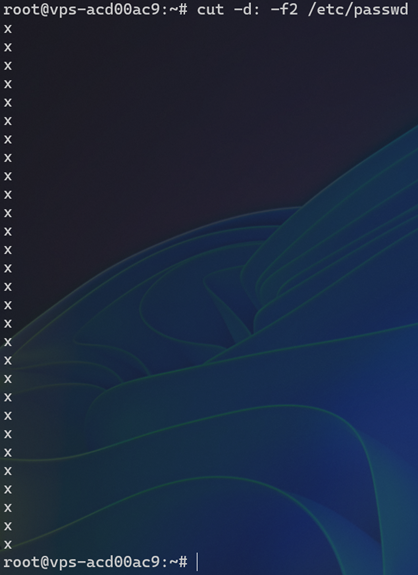

**B.** Utilisez la commande `grep` pour trouver toutes les lignes du fichier `/etc/passwd` contenant le mot « usr » et l’afficher. 📷
> *Ci-dessous, la commande `grep` pour afficher les lignes du fichier `/etc/passwd` contenant le mot « usr ».*
>
> ```bash
> grep 'usr' /etc/passwd
> ```
>
> 

**C.** Écrire un script qui effectue un tri numérique sur le fichier `/etc/passwd` par le nom d’utilisateur : 📷

- Par ordre décroissant.

> *Ci-dessous, le script pour trier le fichier `/etc/passwd` par ordre décroissant.*
>
> ```bash
> sort -t: -k1,1r /etc/passwd
> ```
>
> 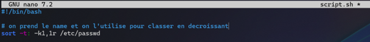

- Afficher uniquement le nom d’utilisateur ainsi que le dossier `/home`.
Le résultat doit afficher uniquement le nom du home avec le nom de l’utilisateur. 📷

> *Ci-dessous, le script pour afficher uniquement le nom d’utilisateur ainsi que le dossier `/home` correspondant.*
>
> ```bash
> cut -d: -f1,6 /etc/passwd
> ```

---

### Traitement de données

**A.** Utilisez `grep` pour compter combien de fois le mot "var" apparaît dans le fichier `/etc/passwd` et afficher le résultat. 📷

> *Ci-dessous, la commande `grep` pour compter le nombre de fois que le mot "var" apparaît dans le fichier `/etc/passwd`.*
>
> ```bash
> grep -o 'var' /etc/passwd | wc -l
> # note: on aurait pu utiliser -c à la place
> ```
>
> 

**B.** Créer un script permettant d’extraire chaque mot séparé par « : » dans un nouveau fichier intitulé `userX` dont `X` sera la ligne extraite.  📷
Autrement dit, par exemple, la ligne 22 du fichier `/etc/passwd` étant :  
`irc:x:39:39:ircd:/var/run/ircd:/usr/sbin/nologin`  
Le nouveau fichier `user22.txt` sera le suivant :

```plaintext
irc
x
39
39
ircd
/var/run/ircd
/usr/sbin/nologin
```

> *Ci-dessous, le script pour extraire chaque mot séparé par « : » dans un nouveau fichier intitulé `userX`.*
>
> ```bash
> Line_number=1
> while IFS =: read -r field1 field2 field3 field4 field5 field6 field7; do
> output_file="user${line_number}.txt"
> echo "$field1" > "$output_file"
> echo "$field2" >> "$output_file"
> echo "$field3" >> "$output_file"
> echo "$field4" >> "$output_file"
> echo "$field5" >> "$output_file"
> echo "$field6" >> "$output_file"
> echo "$field7" >> "$output_file"
> line_number=$(($line_number + 1))
> done < /etc/passwd
> ```
>
> 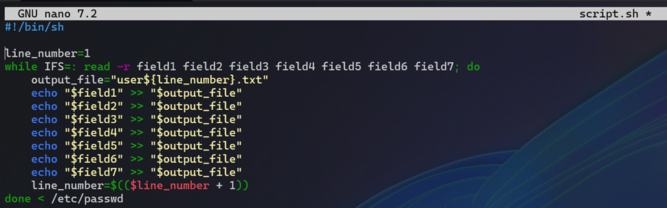

---

## 3. Rendu Documentaire (1,5 heure)

### Justification

Vous devrez réaliser un document professionnel permettant de mettre en évidence votre travail. Le document devra être remis sur Teams sous forme PDF.  
Le nom du document sera :  
`AdminLinux_Bash_4A_IL_ASI_<nom>_<prenom>.pdf`

Des captures d’écrans permettront cela. Vous pourrez y ajouter une légende.  
Nous ne demandons pas une procédure, mais bien les étapes essentielles de la réalisation de ce qui est demandé dans les exigences techniques (chaque fois qu’il y a un icône d’appareil photo, c’est qu’une capture d’écran est demandée).

**L’icône d’appareil photo en question :**  
📷

Bonne évaluation à toutes et tous !
